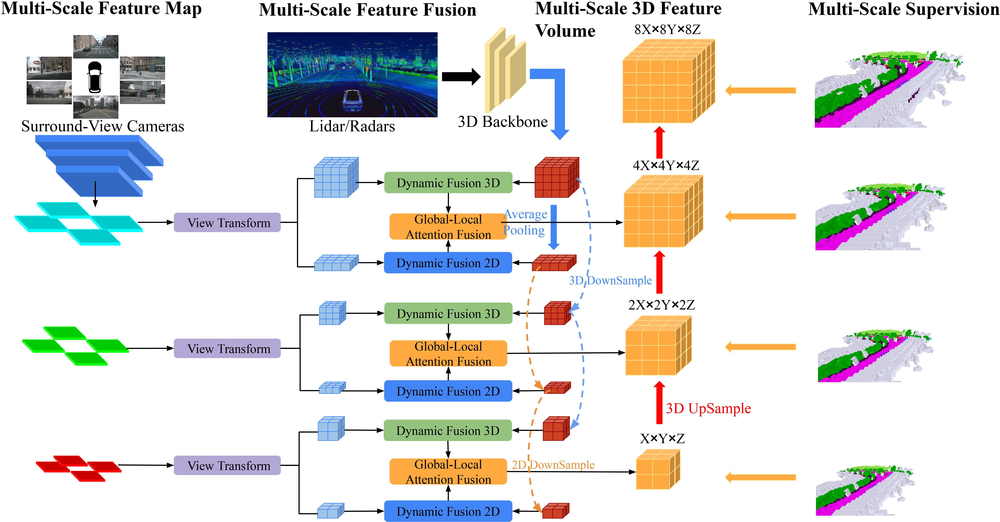

# OccFusion
OccFusion: Multi-Sensor Fusion Framework for 3D Semantic Occupancy Prediction [[Paper](https://ieeexplore.ieee.org/document/10663967)]
## Abstract
A comprehensive understanding of 3D scenes is crucial in autonomous vehicles (AVs), and recent models for 3D semantic occupancy prediction have successfully addressed the challenge of describing real-world objects with varied shapes and classes. However, existing methods for 3D semantic occupancy prediction heavily rely on surround-view camera images, making them susceptible to changes in lighting and weather conditions. This paper introduces OccFusion, a novel sensor fusion framework for predicting 3D semantic occupancy. By integrating features from additional sensors, such as lidar and surround view radars, our framework enhances the accuracy and robustness of occupancy prediction, resulting in top-tier performance on the nuScenes benchmark. Furthermore, extensive experiments conducted on the nuScenes and semanticKITTI dataset, including challenging night and rainy scenarios, confirm the superior performance of our sensor fusion strategy across various perception ranges.
## Method Pipeline
<p align='center'>

</p>

## Benchmark
### Nuscenes val set
<p align='center'>

</p>

### Nuscenes val rainy subset
<p align='center'>

</p>

### Nuscenes val night subset
<p align='center'>

</p>

### Visualization Result
<p align='center'>

</p>

## Model Zoo
| Input Modality | IoU | mIoU | Model Weights |
| :---: | :---: | :---: | :---: | 
| C + R | 32.90 | 20.73 | [ckpt](https://drive.google.com/file/d/1bKGOVez7teuCh91rrMnSYaXVXXm6i18R/view?usp=sharing)
| C + L | 43.53 | 27.55 | [ckpt](https://drive.google.com/file/d/1G4nynOPTzFdNIahBJtPpCTF3AgjmEUHo/view?usp=sharing)
| C + L + R | 43.96 | 28.27 | [ckpt](https://drive.google.com/file/d/1f5KT-w1VZIwvOb-mMGeqplmy7EtZDcvM/view?usp=sharing)
## Getting Started
- [Installation](docs/install.md)
- [Dataset](docs/dataset.md)
- [Run and Eval](docs/getting_started.md)
## Acknowledgement
Many thanks to these excellent projects:
- [Co-Occ](https://github.com/Rorisis/Co-Occ)
- [OpenOccupancy](https://github.com/JeffWang987/OpenOccupancy)
- [SurroundOcc](https://github.com/weiyithu/SurroundOcc)
## Bibtex
If this work is helpful for your research, please consider citing the following BibTeX entry.
```
@article{ming2024occfusion,
  title={OccFusion: Multi-Sensor Fusion Framework for 3D Semantic Occupancy Prediction},
  author={Ming, Zhenxing and Berrio, Julie Stephany and Shan, Mao and Worrall, Stewart},
  journal={IEEE Transactions on Intelligent Vehicles},
  year={2024},
  publisher={IEEE}
}
